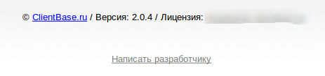
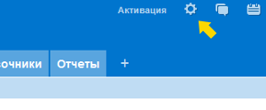
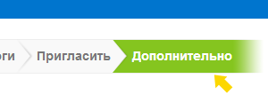
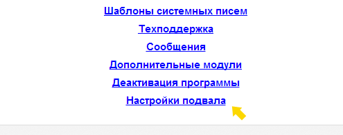

# Отключение копирайта разработчика

Стандартная конфигурация CRM "Клиентской базы" содержит информационный подвал, в котором отображается информация о разработчике (копирайт), версии программы, лицензия, а также ссылка на форму связи с разработчиком.

После активации программы ключом с опцией отключения копирайта в меню "Настройка" в пункте "Дополнительно" появляется пункт настройки подвала, с помощью которого вы можете редактировать информацию, которую содержит подвал.

