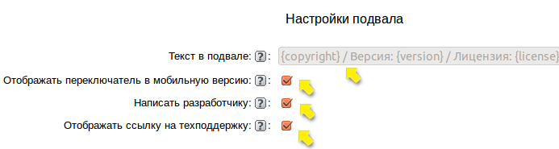
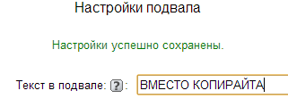
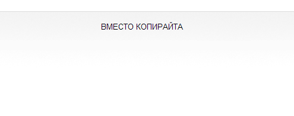
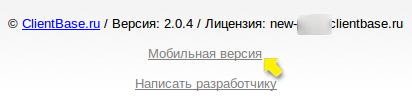
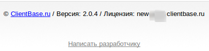
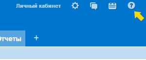
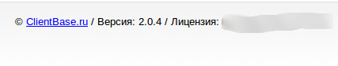

# Настройка подвала

Настройки подвала позволяют:
* разместить в нем любой текст;
* включить/отключить отображение в подвале ссылки на форму связи с разработчиком сайта clientbase.ru;
* включить/отключить отображение ссылки на техподдержку.

После сохранения настроек подвала он будет отображаться в желаемом виде на любой странице программы.

Текст может быть ссылкой. Ссылку нужно прописать в формате html:   `<a href="http://www.mysite.com">mysite.com</a>`.

Отображение переключателя в режим мобильной версии до и после настройки:

Отображение ссылки на техподдержку "Клиентская база" до и после настройки:

Отображение ссылки в подвале на форму связи с разработчиком до и после настройки.

Тест! Документацию необходимо обновить, т.к. сейчас уже намного больше настроект подвала.
