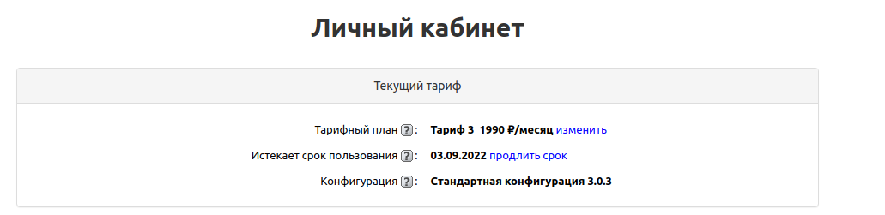
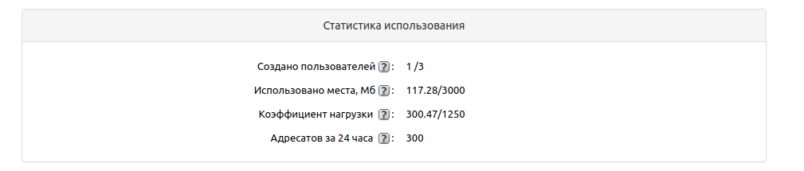
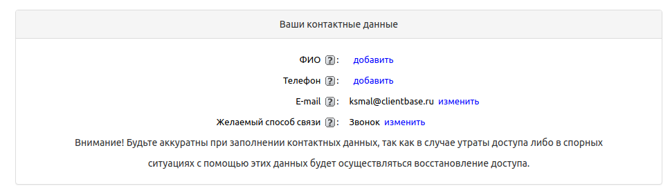
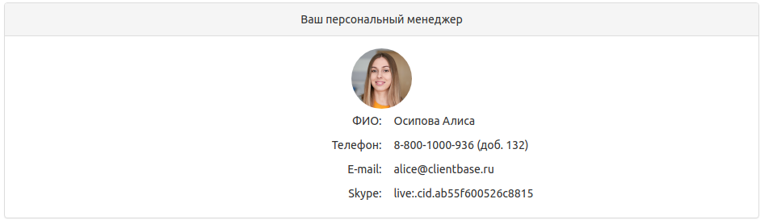
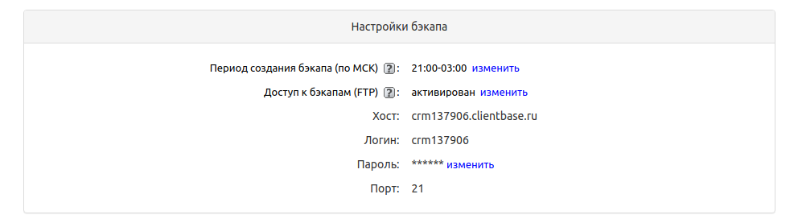
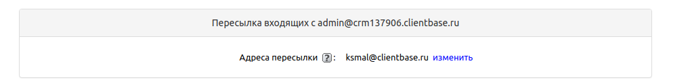
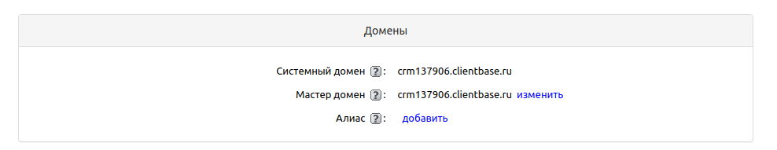
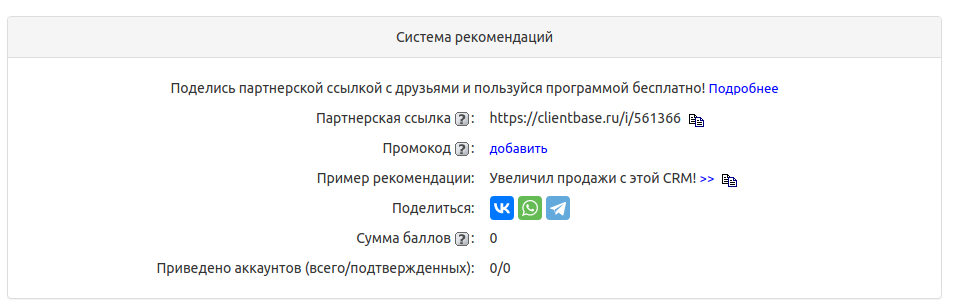
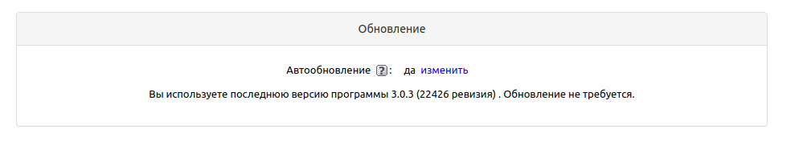

# Личный кабинет

В версии 2.0.10 был обновлен Личный кабинет, в нем вы можете посмотреть информацию о вашем аккаунте. Перейти в него можно в верхем правом углу.

> В личном кабинете вы можете посмотреть информацию о вашей конфигурации, тарифном плане, узнать стоимость аренды и срок действия.

**Конфигурация** – используемая вами конфигурация. Наименование конфигурации отражает те или иные характеристики, которыми наделена программа.

**Тарифный план** – ваш текущий тарифный план. Вы можете изменить свой тарифный план, при этом будет произведен перерасчет срока пользования аккаунта в соответствии со стоимостью нового тарифа. Тарифный план с пометкой Ru означает, что аккаунт размещен на сервере, расположенном на территории Российской Федерации.

**Истекает срок пользования** – срок, до которого оплачен ваш аккаунт. Нажав на "Продлить срок", вы можете выписать себе счет на оплату или оплатить продление аренды аккаунта онлайн.

**Создано пользователей** – количество пользователей, у которых есть доступ к программе. здесь же указано максимально возможное количество пользователей, которое можно добавить в программу. Увеличить возможное число пользователей можно, изменив тарифный план.

**Использовано места, Мб** – использовано места на сервере / всего доступно места на сервере. Увеличить доступное место на сервере можно, изменив тарифный план.

**Коэффициент нагрузки** – коэффициент нагрузки на сервер.

**Адресатов за 24 часа** – количество писем, которое можно разослать из программы в течение 24 часов. Увеличить максимальное количество отправляемых писем можно, изменив тарифный план.

*В личном кабинете также вы можете указать ваши контактные данные и посмотреть данные персонального менеджера, изменить желаемый способ связи:*

### **Настройки бэкапа**

**Автообновление – "Да"** – ежедневное автообновление программы. При обновлении программы все ваши данные и настройки в программе сохраняются. Если выбрано "Нет", автообновление производиться не будет. Вы сможете обновлять свою программу вручную в Личном кабинете.

**Период создания бэкапа (по МСК)** – период, во время которого происходит создание ежедневного бэкапа на стороне сервера. Во время создания бэкапа аккаунт недоступен для работы. Время создания бэкапа зависит от размера аккаунта. Вы можете выбрать подходящий для вас период времени создания бэкапа.

**Доступ к бэкапам (FTP)** – Данная возможность позволяет загружать по FTP бэкапы больших размеров (более 700Mb), которые невозможно загрузить, используя стандартный интерфейс программы.

## **Пересылка входящих**

**Адреса пересылки** – введите один или несколько электронных адресов, на которые будут переправляться письма, приходящие на встроенный ящик вашего аккаунта. Например, ответы клиентов на рассылки. Если вы заносите несколько адресов, разделяйте их запятыми.

## **Домены**

**Системный домен** – Системный домен вашего аккаунта.

**Мастер домен** – Вы можете поменять домен из списка.

**Свой домен** – На тарифном плане Premium вы имеете возможность указать собственный доменный адрес, по которому будет доступна программа. 

## **Система рекомендаций**

> Больше о реферальной программе вы можете узнать [здесь](https://clientbase.ru/news/partprogr/index.html)

## **Обновление**

Здесь вы можете посмотреть версию и ревизию программы, а также обновить ее вручную, если у вас не последняя ревизия.