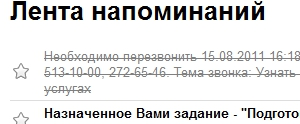
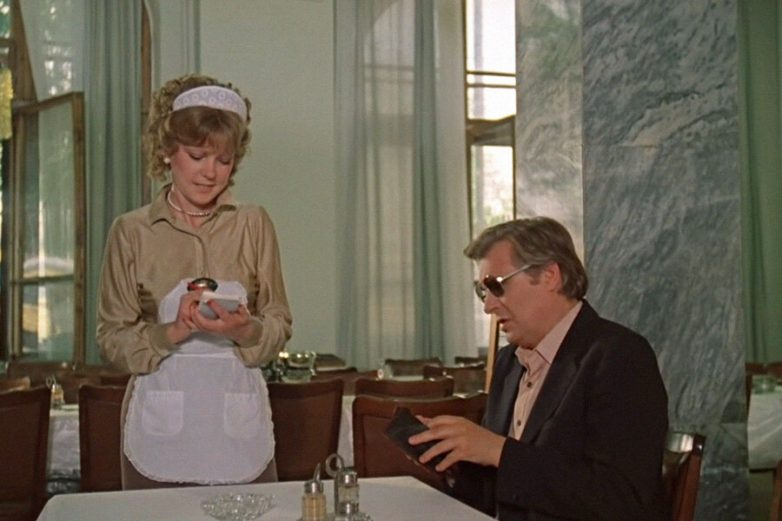
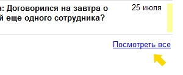
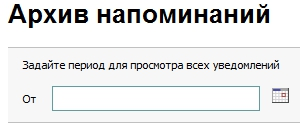
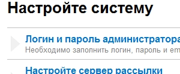
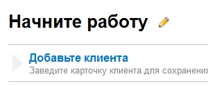
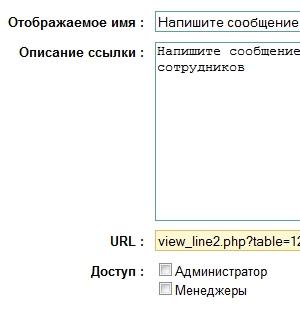
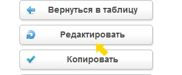
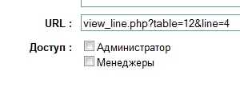
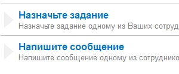

# Рабочий стол

В CRM системе "Клиентская база" имеется удобное представление "рабочий стол".

::: tip ВАЖНО!
Данное представление имеется только во вновь установленных программах, при выборе стандартной или демо конфигураций. При загрузке конфигурации из бэкапа данное представление автоматически не добавляется.
:::

На рабочем столе Вы можете видеть:

[[toc]]

## Лента напоминаний

В ленте напоминаний показываются последние выведенные для нас напоминания. При этом все напоминания, условие которых уже не выполняется (например, когда вы уже выполнили поставленное задание) показываются перечеркнутыми.

*Кадр из фильма "Вокзал для двоих"* 111

Нажав на клавишу "Посмотреть все", мы попадаем в архив напоминаний, где показываются все напоминания, которые выводились для нас ранее.

Также в данном разделе есть возможность просмотра напоминаний за определенный период,

## Настройки системы

Настройки системы показываются только у администратора программы. В данном меню отображаются ссылки для быстрой настройки самых важных аспектов программы.

## Меню ссылок

Данный раздел рабочего стола предназначен для хранения ссылок на самые посещаемые разделы программы и внешние сайты.

Для того чтобы добавить свою закладку в данное меню, необходимо перейти в таблицу "Ссылки на стартовой", нажав на изображение карандаша рядом с надписью "Начните работу".

Затем в появившейся таблице нужно добавить новую строку, указав отображаемое имя ссылки, ее краткое описание и URL-адрес. После ввода значений нажмите "Сохранить".

**Важно:** Если вы собираетесь добавить ссылку на внешний адрес, то после самого url необходимо добавить символы "?1".

После создания ссылки следует указать, какие группы доступа смогут ее использовать. Для этого нажимаем кнопку "Редактировать" и ставим галочку напротив групп, которым мы разрешим доступ к ссылке.

**Важно:** Для версии 1.9.5 и выше повторно заходить в режим редактирования не нужно. Группы, для которых будут доступны ссылки, можно установить при создании записи.

В результате этих действий мы увидим добавленную нами ссылкув меню "Начните работу".

